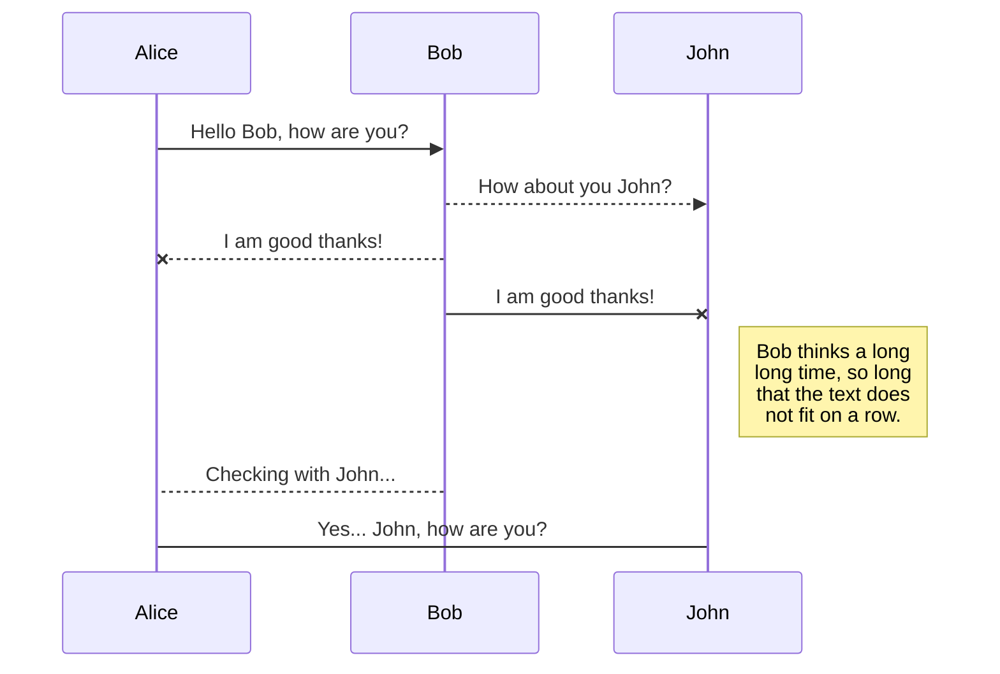

# Software Engineering – Assignment 1

Hyphen Technologies Software Engineering - Assignment 1

## Assignment

Design a complete billing system which will be used to manage the different types of financial transactions and access to Hyphen billable components and services.

## **Requirements**

You need to make sure that the below requirements are covered:

- The billing system must be able to integrate with multiple payment gateways.
- The system must support both one time payment and subscription.
- The system should be able to allow the client to enter, validate, and save multiple credit cards.
- The system must adhere to the microservices principles.
- The system must be well secured.
- The system should be able to handle errors gracefully.
- The client must be notified by email and SMS once a successful payment completed.
- The client must receive a digital invoice (PDF file) in an email.
- The client must be notified by email and SMS in case of a failed payment.
- The client must receive a payment reminder to fix the payment methods.
- The client must be able to manually pay again once the payment method is fixed.
- The client should be able to retrieve billing history and download the digital invoices.
- The client should not be able to use Hyphen components and services if the payment is due and the last attempt has failed.

## **Process**
**Describe all system components (services, technologies to be used, interfaces),** **make sure to provide as much details as possible**, use text and drawings and finally **justify all of your decisions** 

## **Deliverables**

Documents (text and diagrams) arranged properly covering everything mentioned previously.
## Example UML diagram

You can use similar diagrams to describe **all communications** between the billing system components:
> Open the below using stackedit.io so that you'll be able to see the actual diagram

